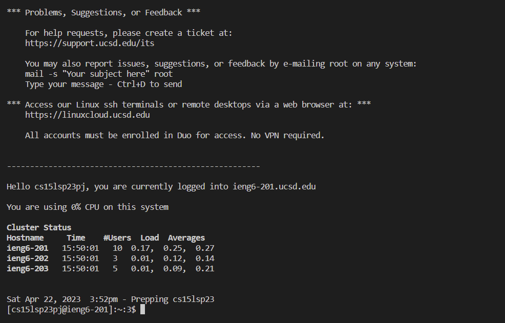
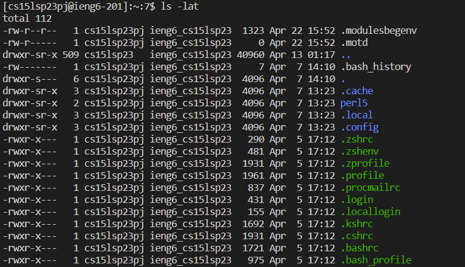
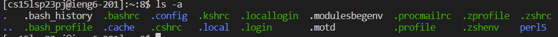
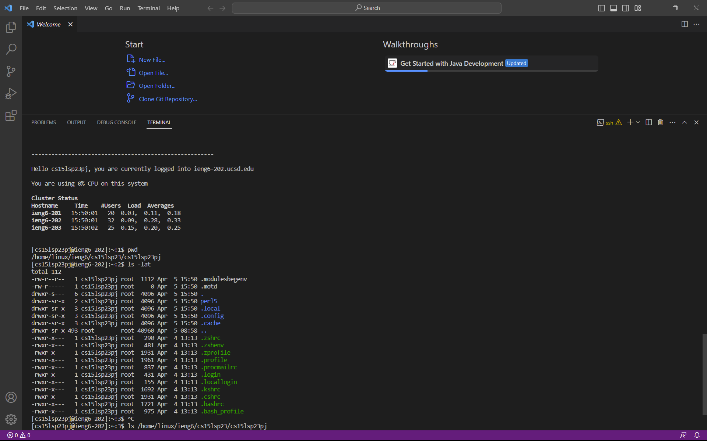

# A Beginner's Guide
## A tutorial on how to access your course-specific account
---
**First we must download VS Code, which is going to be essential in being able to use our account.**
* Click on this link to go to VS Code's download site [Link](https://code.visualstudio.com/download). Click the appropriate download for your computer.

* You shouldn't need to change anything while setting up VS Code.

**We will now remotely connect using the terminal**
* Once you are done setting up, open up VS Code. It should look like the following:

* If you do not see the terminal, you can click the terminal button wich can be found at the top of the page in the middle of run and help. Choose New Terminal.
* Once the terminal is open you are going to type: ssh accountname@ieng6.ucsd.edu
* Your account name should be the account username for for your cse 15 class.
* You should be able to find your username using this [Link](https://sdacs.ucsd.edu/~icc/index.php). Sign into the Account Lookup and your username is the one that starts with cs15lsp.
* You will probably be asked: Are you sure you want to continue connecting (yes/no/[fingerprint])? Type yes
* The terminal will now ask you for your password which is the ucsd password you are currently using or can be changed by visiting following website [Link](https://sdacs.ucsd.edu/~icc/index.php).
* You have now logged in and connected to a computer in the CSE basement!

**We can now type in commands**
* Try using command pwd. What happens? This is your current directory.
* Now try using the following commands:
* cd ~
* cd
* ls -lat

* ls -a

* You can try these commands in any order and you should get a response

