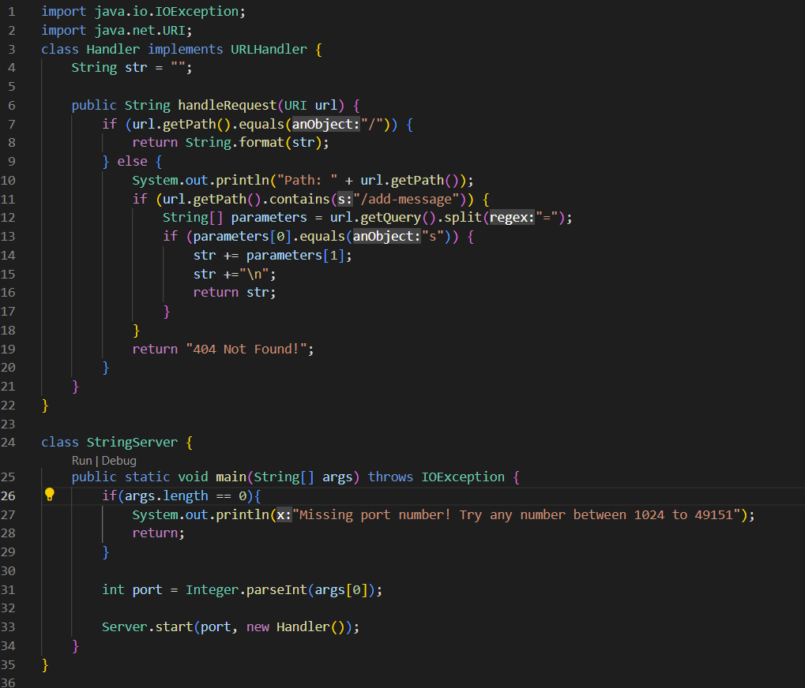
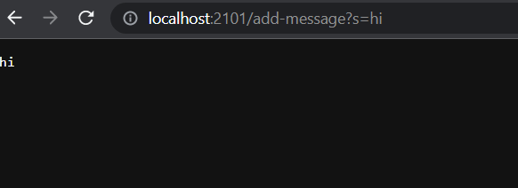
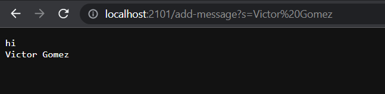
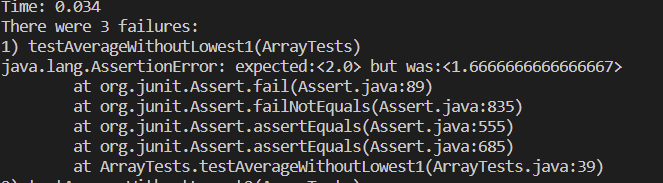
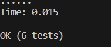

# Lab Report 3
---
## **Part 1**



**EXAMPLE 1:**



Methods called: public String handleRequest(URI url), public static void main(String[] args) throws IOException, public void handle(final HttpExchange exchange) throws IOException, public static void start(int port, URLHandler handler) throws IOException

Relevant arguments in method: This if statement is important since it is staing that if the url has the string "/add-message" it will then also search for the string "s" and add any string after "s="
```
if(url.getPath().contains("/add-message")) {
                String[] parameters = url.getQuery().split("=");
                if (parameters[0].equals("s")) {
                    str += parameters[1];
                    str +="\n";
                    return str;
```
These are important to the code because it checks if a new message is being added if not then nothing will be presented in site.
How the values change: I have a string value named str which at first is blank but then changes and adds the string that is inputted in search bar.

**EXAMPLE 2:**



Method called:  public String handleRequest(URI url), public static void main(String[] args) throws IOException, public void handle(final HttpExchange exchange) throws IOException, public static void start(int port, URLHandler handler) throws IOException
Relevant arguments in method: The same if statement is important in this case but more importantly the "str+=" is importnat because it allows us to add new strings without having to worry about the previous string not showing up:
```
if(url.getPath().contains("/add-message")) {
                String[] parameters = url.getQuery().split("=");
                if (parameters[0].equals("s")) {
                    str += parameters[1];
                    str +="\n";
                    return str;
```
How the values change: the str now adds the new string that is inputted and in the if statement I have “\n” be added right after so that the new string can be seen in another line.
 ```
 str += parameters[1];
                    str +="\n";
                    return str;
```


## **Part 2:**

Failure inducing input:
 ```
 @Test
  public void testAverageWithoutLowest1() {
    double[] input1 = { 1.0, 1.0, 2.0, 3.0  };
    double ans = ArrayExamples.averageWithoutLowest(input1);
    assertEquals( 2.0 , ans , 0);
  }
```
Input doesn’t include failure:
```
 @Test
  public void testAverageWithoutLowest4() {
    double[] input1 = { 1, 2, 3, 4 };
    double ans = ArrayExamples.averageWithoutLowest(input1);
    assertEquals( 3.00 , ans , 0.01);
  }
```
Symptom 1st input:



Symptom 2nd Input:
The 2nd input worked so did not have any noticeable failures.



The bug(Before):
```
 static double averageWithoutLowest(double[] arr) {
    if(arr.length < 2) { return 0.0; }
    double lowest = arr[0];
    for(double num: arr) {
      if(num < lowest) { lowest = num; }
    }
    double sum = 0;
    for(double num: arr) {
      if(num != lowest) { sum += num; }
    }
    return sum / (arr.length - 1);
  }
```
The bug(After/fixed):
```
  static double averageWithoutLowest(double[] arr) {
    if(arr.length < 2) { return 0.0; }
    double lowest = arr[0];
    for(double num: arr) {
      if(num < lowest) { lowest = num; }
    }
    double sum = 0;
    for(double num: arr) {
       sum += num;
    }
    sum -= lowest;
    return sum / (arr.length - 1);
  }
```

Explanation:
The problem with this code was that it wouldn't count any of the numbers that were equal to the lowest including duplicits. To solve this problem all we have to do is get rid of the if statement inside the for loop:
```
for(double num: arr) {
      if(num != lowest) { sum += num; }
    }
```
instead we just add all the numbers into the sum and then we just delete the lowest number from the sum after the for loop is complete. This way we dont have to worry about one of the numbers not being added since we are just getting of one of the lowest numbers.
The second test works since there are no duplicate numbers so the code recognizes that 1 is the lowest number and the if statement does not add the 1, it does add 2,3 and 4 though resulting the sum to be 9 which is then divided by the amount of numbers that were added which is 3. This gives is the correct answer of 3.0.

## **Part 3:** 
I was able to learn how to start a new server and be able to search it up on a website. I was also able to learn new ways to test programs, especially the use of helper methods to be able to use less tester methods.

