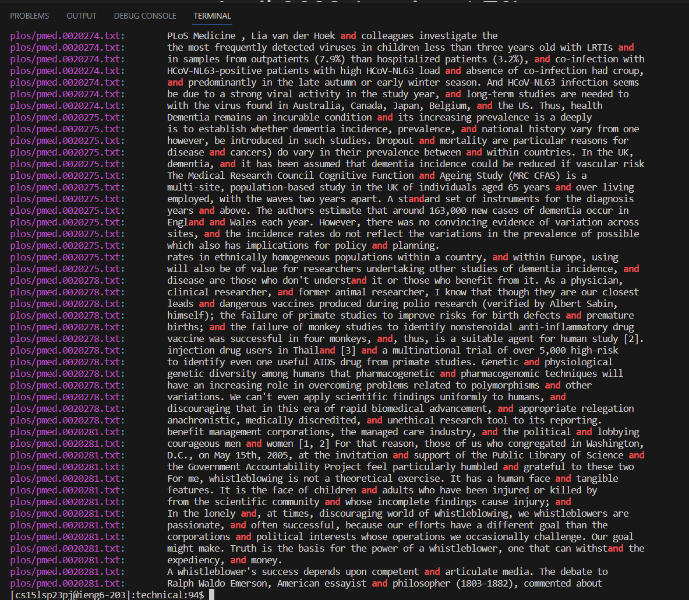
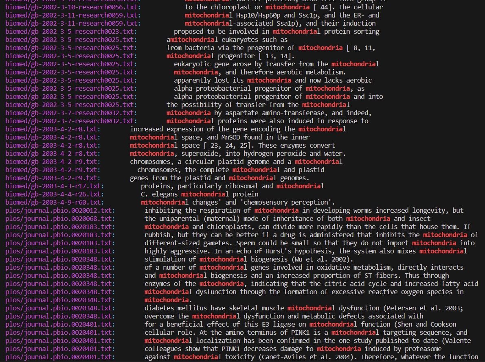

# Lab Report 3
## Researching Commands
I will be researching grep and looking for alternate ways I can use this command.
## **grep -r**
grep -r allows users to find a specific string in a directory and in other subdirectories.
* I used grep -r to find a broad word and see if that would work or break my computer this was the result when i used command
grep -r "and":

Here we see that it is going through all the files in the technical/ directory. It is not clear through picture but it has files from the biomed, plos, 911report and government directories.
* I also used grep -r to look for a more specific word, this is what happened when I searched for grep -r "mitochondria":

Here we can see more clearly that this function searches through both biomed and plos files. 
---
## **grep -c**
What if I wanted to see how many times the word "and" is used in a specific file, the command grep -c counts how many lines contain the word "and"
* I will test grep -c to find how many lines "and" appears in the file pmed.0020278.txt by using the command: grep -c "and" plos/pmed.0020278.txt
```
# [cs15lsp23pj@ieng6-203]:technical:98$ grep -c "and" plos/pmed.0020278.txt
13
```
