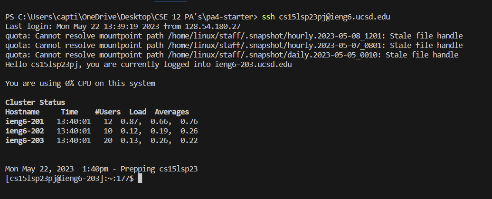
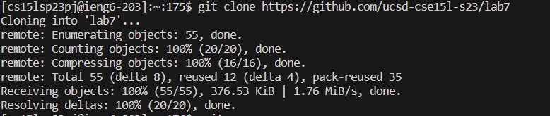
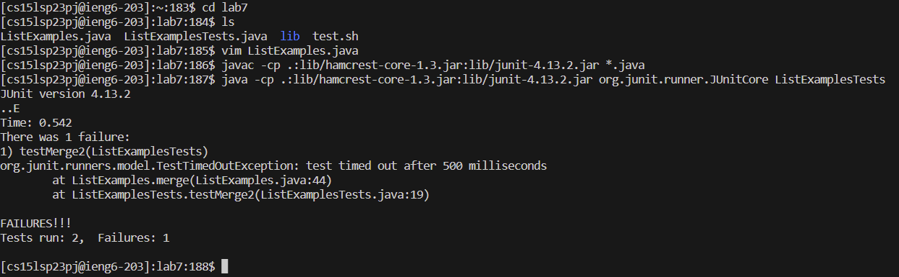
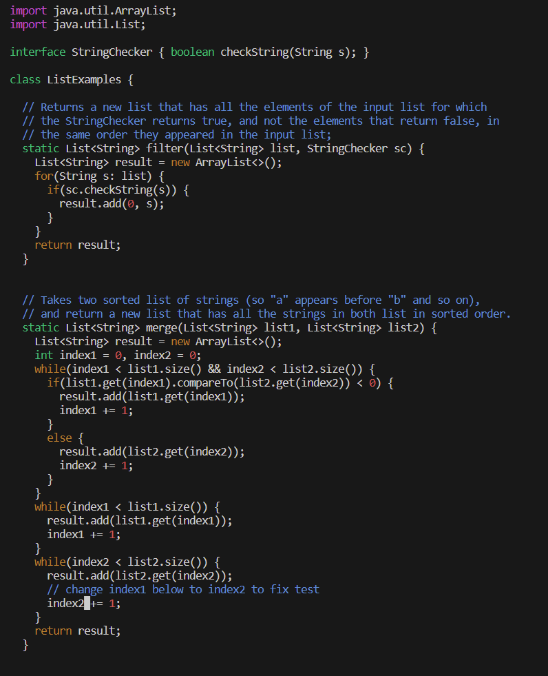
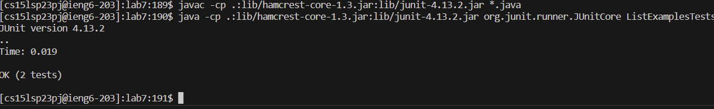
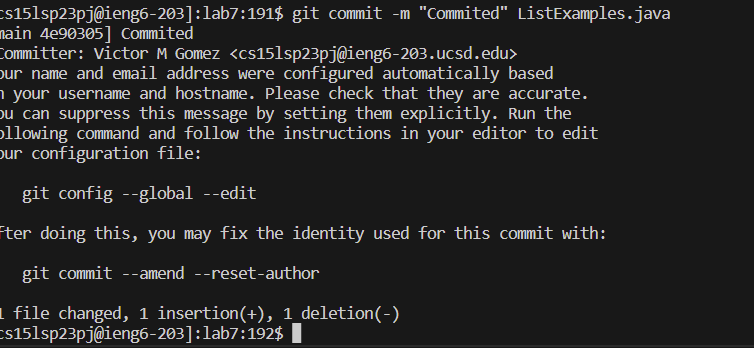

# Lab Report 4
## Steps on fixing failed test
I will be recreating the steps I took in fixing the bug in list examples.
## **Step 1**

keys pressed: *ssh <space> cs15lsp23pj <Shift> 2 ucsd.edu <enter>* 
  
  With these characters I was able to log into my remote account and did not need to enter my password because of the saved ssh key.

## **Step 2**

keys pressed: *git <space> clone <space> <ctrl> v <enter>*
  
    With these characters I was able to clone the link that had been given to me which was https://github.com/ucsd-cse15l-s23/lab7. This allowed me to have acces     to the file lab7, which contained ListExamples.java and ListExamplesTests.java.
  
## **Step 3**

keys pressed: *cd <space> lab7 <enter>, <up><up><up><enter>, <up><up><enter>*
  
    With these characters I was able to enter the lab7 file which give me access to the file needed to run the test. I pressed the up button 3 times because the       command javac -cp .:lib/hamcrest-core-1.3.jar:lib/junit-4.13.2.jar *.java is in my command history. I then pressed the up button twice to access the command       java -cp .:lib/hamcrest-core-1.3.jar:lib/junit-4.13.2.jar org.junit.runner.JUnitCore ListExamplesTests. This will then run the tests and we see that their is     a failure in the code.

## **Step 4**

  
keys pressed: *vim <shift> l ist <tab> . <tab><enter>, /index1 <enter> n(x10),i, <right>(x6), <backspace>, 2, <esc>, :wq, <enter>*
  
  With these keys I was able to open java file in vim, search for index1, and edit the index1 that was meant to be a index2. Once I edited that by entering insert   mode by pressing i, I was able to escape and use :wq to save and exit the java file.
## **Step 5**
  
  
   keys pressed: *<up><up><enter>, <up><up><up><enter>*
  
  I used my command history to be able to easily test my code again and check if my fixes worked.
## **Step6**
  
  
  Keys pressed: *git, <space>, commit, <space>, -m, space, <Shift> ', Commited, <shift> ', <shift> l, ist, <tab>, <enter>
  
    With these keys I was able to commit the fixed java file and have the statement "Commited" printed. 
  
